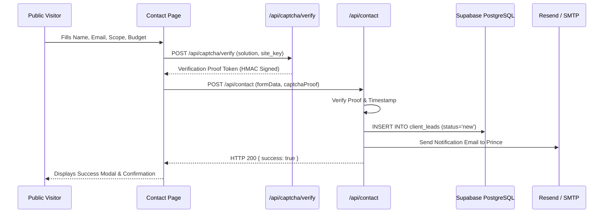
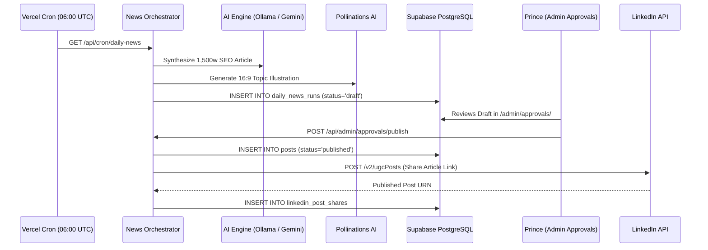

# Data Flow Diagrams

## 1. Inbound Lead Capture & Captcha Verification

```mermaid
sequenceDiagram
    participant User as Public Visitor
    participant UI as Contact Page
    participant Captcha as /api/captcha/verify
    participant API as /api/contact
    participant DB as Supabase PostgreSQL
    participant Email as Resend / SMTP

    User->>UI: Fills Name, Email, Scope, Budget
    UI->>Captcha: POST /api/captcha/verify (solution, site_key)
    Captcha-->>UI: Verification Proof Token (HMAC Signed)
    UI->>API: POST /api/contact (formData, captchaProof)
    API->>API: Verify Proof & Timestamp
    API->>DB: INSERT INTO client_leads (status='new')
    API->>Email: Send Notification Email to Prince
    API-->>UI: HTTP 200 { success: true }
    UI-->>User: Displays Success Modal & Confirmation
```

---

## 2. Daily News Ingest to LinkedIn Publishing

```mermaid
sequenceDiagram
    participant Cron as Vercel Cron (06:00 UTC)
    participant Orchestrator as News Orchestrator
    participant AI as AI Engine (Ollama / Gemini)
    participant Visual as Pollinations AI
    participant DB as Supabase PostgreSQL
    participant Admin as Prince (Admin Approvals)
    participant LinkedIn as LinkedIn API

    Cron->>Orchestrator: GET /api/cron/daily-news
    Orchestrator->>AI: Synthesize 1,500w SEO Article
    Orchestrator->>Visual: Generate 16:9 Topic Illustration
    Orchestrator->>DB: INSERT INTO daily_news_runs (status='draft')
    Admin->>DB: Reviews Draft in /admin/approvals/
    Admin->>Orchestrator: POST /api/admin/approvals/publish
    Orchestrator->>DB: INSERT INTO posts (status='published')
    Orchestrator->>LinkedIn: POST /v2/ugcPosts (Share Article Link)
    LinkedIn-->>Orchestrator: Published Post URN
    Orchestrator->>DB: INSERT INTO linkedin_post_shares
```
