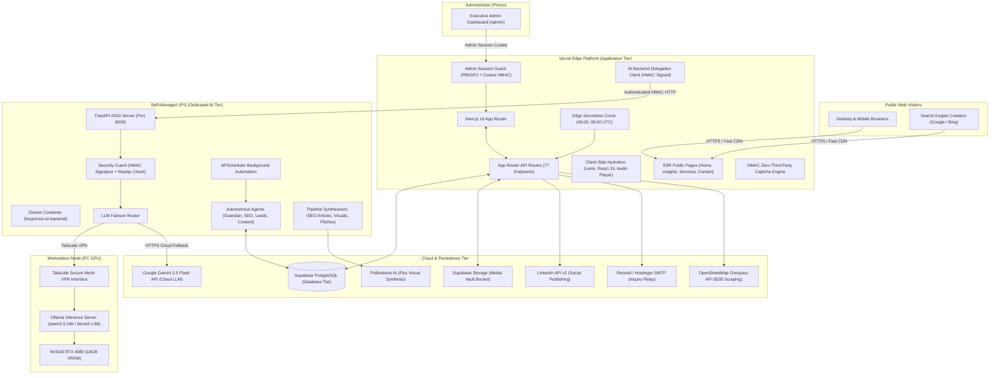

# Master Architecture Diagram

```mermaid
flowchart TB
    subgraph PublicVisitors["Public Web Visitors"]
        V1["Desktop & Mobile Browsers"]
        V2["Search Engine Crawlers (Google / Bing)"]
    end

    subgraph AdminUser["Administrator (Prince)"]
        A1["Executive Admin Dashboard (/admin)"]
    end

    subgraph VercelEdge["Vercel Edge Platform (Application Tier)"]
        direction TB
        N1["Next.js 16 App Router"]
        N2["SSR Public Pages (Home, Insights, Services, Contact)"]
        N3["Client-Side Hydration (Lenis, React 19, Audio Player)"]
        N4["App Router API Routes (77 Endpoints)"]
        N5["HMAC Zero-Third-Party Captcha Engine"]
        N6["Admin Session Guard (PBKDF2 + Cookie HMAC)"]
        N7["AI Backend Delegation Client (HMAC Signed)"]
        N8["Edge Serverless Crons (06:00, 08:00 UTC)"]
    end

    subgraph PythonVPS["Self-Managed VPS (Dedicated AI Tier)"]
        direction TB
        P1["Docker Container (heyprince-ai-backend)"]
        P2["FastAPI ASGI Server (Port 8000)"]
        P3["Security Guard (HMAC Signature + Replay Check)"]
        P4["LLM Failover Router"]
        P5["Autonomous Agents (Guardian, SEO, Leads, Content)"]
        P6["Pipeline Synthesizers (SEO Articles, Visuals, Pitches)"]
        P7["APScheduler Background Automation"]
    end

    subgraph LocalHardware["Workstation Node (PC GPU)"]
        direction TB
        L1["NVIDIA RTX 4080 (16GB VRAM)"]
        L2["Ollama Inference Server (qwen2.5:14b / llama3.1:8b)"]
        L3["Tailscale Secure Mesh VPN Interface"]
    end

    subgraph ExternalCloud["Cloud & Persistence Tier"]
        direction TB
        C1[("Supabase PostgreSQL (Database Tier)")]
        C2["Supabase Storage (Media Vault Bucket)"]
        C3["Google Gemini 2.5 Flash API (Cloud LLM)"]
        C4["Pollinations AI (Flux Visual Synthesis)"]
        C5["LinkedIn API v2 (Social Publishing)"]
        C6["Resend / Hostinger SMTP (Inquiry Relay)"]
        C7["OpenStreetMap Overpass API (B2B Scraping)"]
    end

    V1 & V2 -->|HTTPS / Fast CDN| N2
    A1 -->|Admin Session Cookie| N6
    N6 --> N1
    N1 <--> N4
    N4 <--> C1
    N4 <--> C2
    N4 --> C5
    N4 --> C6
    N4 --> C7
    N8 --> N4

    N7 -->|Authenticated HMAC HTTP| P2
    P2 --> P3
    P3 --> P4
    P4 -->|Tailscale VPN| L3
    L3 --> L2
    L2 --> L1
    P4 -->|HTTPS Cloud Fallback| C3
    P6 --> C4
    P5 <--> C1
    P7 --> P5
```
